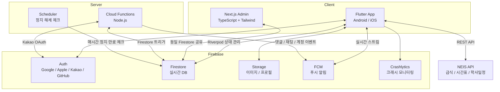
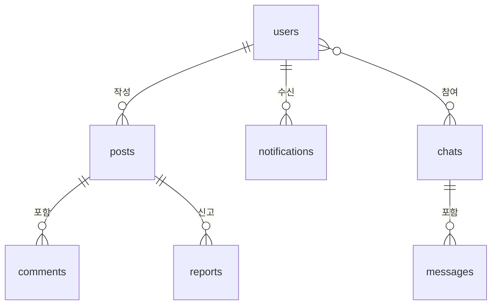

# 한솔고등학교 앱


> English: [README_en.md](./README_en.md)

[](https://github.com/Monkshark/hansol_hs_flutter_app/actions/workflows/flutter.yml)
[](https://github.com/Monkshark/hansol_hs_flutter_app/actions/workflows/firestore-rules.yml)


[](https://codecov.io/gh/Monkshark/hansol_hs_flutter_app)


> 세종시 한솔고등학교 학생·교사·졸업생·학부모를 위한 통합 학교 플랫폼

Flutter 기반 모바일 앱 + Next.js 관리자 대시보드로 구성된 풀스택 프로젝트입니다. NEIS 공공데이터 API 연동, Firebase 실시간 데이터베이스, 역할 기반 권한 시스템, 푸시 알림, 1:1 채팅 등 실서비스 수준의 기능을 구현했습니다.

[개발 블로그](https://monkshark.github.io/categories/%ED%95%9C%EC%86%94%EA%B3%A0-%EC%95%B1-%EA%B0%9C%EB%B0%9C%EA%B8%B0/)

## 문서 허브

주제별로 문서가 분산되어 있습니다. 목적에 맞춰 들어가세요.

### 처음 기여하는 팀원
1. [제품 개요](https://monkshark.github.io/hansol_hs_flutter_app/#guides/product-overview.md) — 앱의 존재 이유와 범위
2. [아키텍처 개요](https://monkshark.github.io/hansol_hs_flutter_app/#guides/architecture-overview.md) — 시스템 그림, Riverpod 그래프, 데이터 흐름
3. [아키텍처 의사결정 일지](https://monkshark.github.io/hansol_hs_flutter_app/#guides/architecture-decisions.md) — 8개 ADR + 권한 4단계 / PIPA
4. 피처 상세: [공개](https://monkshark.github.io/hansol_hs_flutter_app/#features/public-features.md) / [커뮤니티](https://monkshark.github.io/hansol_hs_flutter_app/#features/community-features.md) / [개인](https://monkshark.github.io/hansol_hs_flutter_app/#features/personal-features.md) / [관리자](https://monkshark.github.io/hansol_hs_flutter_app/#features/admin-features.md)
5. [기여 가이드](https://monkshark.github.io/hansol_hs_flutter_app/#CONTRIBUTING.md)

### 엔드유저 (재학생 / 교사 / 졸업생 / 학부모)
- [사용자 가이드](https://monkshark.github.io/hansol_hs_flutter_app/#USER_GUIDE.md) — 가입부터 주요 기능까지
- [공개 기능](https://monkshark.github.io/hansol_hs_flutter_app/#features/public-features.md) — 급식/시간표/학사일정
- [인증 & 접근](https://monkshark.github.io/hansol_hs_flutter_app/#guides/account-and-access.md) — 역할·승인·탈퇴

### 운영 / 배포 담당자
- [배포 가이드](https://monkshark.github.io/hansol_hs_flutter_app/#DEPLOY.md) — rules / functions / 앱 / 관리자 웹
- [CI/CD 설정](https://monkshark.github.io/hansol_hs_flutter_app/#guides/cicd-setup.md) — GitHub Actions 두 워크플로우
- [보안 모델](https://monkshark.github.io/hansol_hs_flutter_app/#guides/security.md) — Firestore rules, 개인정보
- [아키텍처 개요](https://monkshark.github.io/hansol_hs_flutter_app/#guides/architecture-overview.md)

### 기타 심화 문서
- [데이터 모델](https://monkshark.github.io/hansol_hs_flutter_app/#guides/data-model.md) — 컬렉션 스키마 + 인덱스 + rules 연관
- [테스트 전략](https://monkshark.github.io/hansol_hs_flutter_app/#guides/testing.md) — 563 Flutter + 85 Rules 테스트
- [PIPA 마이그레이션 가이드](https://monkshark.github.io/hansol_hs_flutter_app/#guides/pipa-migration.md) — custom claims 백필 + TTL 컬렉션 설계
- [PIPA 통합 테스트 시나리오](https://monkshark.github.io/hansol_hs_flutter_app/#guides/pipa-integration-tests.md) — 이의신청·데이터 요청·역할 분리
- [기술 과제 14건](https://monkshark.github.io/hansol_hs_flutter_app/#guides/technical-challenges.md) — 실제 문제 해결 사례
- [스크린샷 갤러리](https://monkshark.github.io/hansol_hs_flutter_app/#guides/screenshots-gallery.md) — 전체 UI 투어

### 파일별 기술 레퍼런스
> 서비스·모델·API·알림 등 핵심 계층 파일별 상세 문서 (특정 파일을 수정하거나 동작 흐름을 추적할 때)

- [📚 API Reference 전체 목차](https://monkshark.github.io/hansol_hs_flutter_app/#README.md) — 아래 항목 통합 인덱스
- [`main.md`](https://monkshark.github.io/hansol_hs_flutter_app/#main.md) — 앱 진입점, MainScreen, 전역 상태
- **API 계층** (`docs/api/`): [meal_data_api](https://monkshark.github.io/hansol_hs_flutter_app/#api/meal_data_api.md) · [timetable_data_api](https://monkshark.github.io/hansol_hs_flutter_app/#api/timetable_data_api.md) · [notice_data_api](https://monkshark.github.io/hansol_hs_flutter_app/#api/notice_data_api.md)
- **데이터 계층** (`docs/data/`): [auth_service](https://monkshark.github.io/hansol_hs_flutter_app/#data/auth_service.md) · [grade_manager](https://monkshark.github.io/hansol_hs_flutter_app/#data/grade_manager.md) · [local_database](https://monkshark.github.io/hansol_hs_flutter_app/#data/local_database.md) · [post_repository](https://monkshark.github.io/hansol_hs_flutter_app/#data/post_repository.md) · [search_tokens](https://monkshark.github.io/hansol_hs_flutter_app/#data/search_tokens.md) · [service_locator](https://monkshark.github.io/hansol_hs_flutter_app/#data/service_locator.md) · [setting_data](https://monkshark.github.io/hansol_hs_flutter_app/#data/setting_data.md) · 외 다수
- **알림** (`docs/notification/`): [fcm_service](https://monkshark.github.io/hansol_hs_flutter_app/#notification/fcm_service.md) · [daily_meal_notification](https://monkshark.github.io/hansol_hs_flutter_app/#notification/daily_meal_notification.md) · [popup_notice](https://monkshark.github.io/hansol_hs_flutter_app/#notification/popup_notice.md) · [update_checker](https://monkshark.github.io/hansol_hs_flutter_app/#notification/update_checker.md)
- **상태 관리** (`docs/providers/`): [providers](https://monkshark.github.io/hansol_hs_flutter_app/#providers/providers.md) — Riverpod Notifier/AsyncNotifier 전체
- **네트워크** (`docs/network/`): [network_status](https://monkshark.github.io/hansol_hs_flutter_app/#network/network_status.md) · [offline_queue_manager](https://monkshark.github.io/hansol_hs_flutter_app/#network/offline_queue_manager.md)
- **스타일** (`docs/styles/`): [app_colors](https://monkshark.github.io/hansol_hs_flutter_app/#styles/app_colors.md) · [dark_app_colors](https://monkshark.github.io/hansol_hs_flutter_app/#styles/dark_app_colors.md) · [light_app_colors](https://monkshark.github.io/hansol_hs_flutter_app/#styles/light_app_colors.md)

## 스크린샷 (요약)

| 홈 | 게시판 | 채팅 | 시간표 |
|:--:|:--:|:--:|:--:|
|  |  |  |  |

| 급식 | 검색 결과 | 수시 성적 | Admin Web |
|:--:|:--:|:--:|:--:|
|  |  |  |  |

전체 스크린샷 → [스크린샷 갤러리](https://monkshark.github.io/hansol_hs_flutter_app/#guides/screenshots-gallery.md)

## Metrics

| 지표 | 수치 | 비고 |
|------|------|------|
| **총 코드 라인** | **약 43,000** | Dart 36,031 + TypeScript/TSX + Java/XML + Swift + JS |
| **소스 파일** | **139개** (Flutter) + **30개** (Admin Web TS/TSX) + Android/iOS 위젯 | screens, 추출 위젯, models/utils/services |
| **권한 모델** | **4단계** | `user` / `moderator` / `auditor` / `manager` / `admin` — Firebase Auth custom claims로 검사, Firestore `get()` 0회 |
| **PIPA 컴플라이언스** | **3개 컬렉션** | `appeals`(이의신청 90일 TTL) · `data_requests`(데이터 요청 30일 TTL) · `community_rules` |
| **Cloud Functions** | **24개** | Kakao/School OTP · 트리거(댓글/게시글/좋아요/사용자 CRUD/채팅/신고) · 정지 만료 스케줄러 · OG 렌더러 · 오래된 글 청소 · 데이터 익스포트 · 누진 정지 · 학년 자동 진급 · 교사 초대 |
| **OAuth 로그인** | **4종** | Google, Apple, Kakao, GitHub |
| **푸시 알림** | **FCM 타입 4종** | `account` / `comment` / `new_post` / `chat` (+ 로컬 조식/중식/석식 3종). 카테고리별 개별 on/off |
| **테스트** | **563 / 85개** | Flutter 559 (test 470 + testWidgets 89) + Integration 4 + Firestore Rules emulator 85 |
| **문서** | **106개 MD** | 루트 9 + `docs/guides/` 22 + `docs/features/` 8 + 파일별 상세 `docs/{api,data,...}` 67 |
| **상태 관리** | **Riverpod 2.5** | AsyncNotifier / Notifier 기반, GetIt + Repository 패턴 DI |
| **이미지 압축** | **용량 70% 감소** | 게시글 1080px (EXIF/GPS 제거), 프로필 256px |
| **검색** | **Firestore n-gram 인덱스** | 제목+본문 2-gram array-contains-any, 350ms debounce |
| **민감 데이터** | **flutter_secure_storage** | 성적은 Android Keystore / iOS Keychain 저장 |
| **API 최적화** | **호출 30회 → 1회** | 월간 프리페치 + Completer 패턴 |
| **Firestore 절감** | **읽기 30~50% 감소** | 오프라인 캐시 + limit 최적화 |
| **운영 비용** | **$0~3/월** | 1,000명 기준, 무료 한도 내 운영 가능 |

### 성능 / 사이즈 (실측)

| 항목 | 수치 | 측정 방법 |
|------|------|----------|
| **Release APK** | **27 MB** | `build/app/outputs/flutter-apk/app-release.apk` (단일 universal) |
| **Dart 라인 수** | **36,031** | `find lib -name '*.dart' \| xargs cat \| wc -l` |
| **Dart 파일 수** | **139개** | `find lib -name '*.dart' \| wc -l` |
| **Flutter test 수** | **563** | test() 470 + testWidgets() 89 + Integration 4 |
| **Rules test 수** | **85** | `firebase emulators:exec ... npm test` (4단계 역할 + PIPA 컬렉션 검증 포함) |
| **이미지 압축 후 크기** | **원본 대비 ~30%** | 1080px 폭, JPEG quality 80, EXIF 제거 |
| **검색 fetch 상한** | **50건 / 350ms debounce** | `array-contains-any` + 클라이언트 substring 필터 |
| **게시판 페이지** | **20건 cursor pagination** | `startAfterDocument` + `limit(20)` |

## 아키텍처 요약



- **Riverpod Provider 의존성 그래프**, **데이터 흐름 계층 모델** → [architecture-overview.md](https://monkshark.github.io/hansol_hs_flutter_app/#guides/architecture-overview.md)
- 저장소 분담(sqflite/Firestore/SecureStorage/Storage) 설계 근거 → [ADR-06](https://monkshark.github.io/hansol_hs_flutter_app/#guides/architecture-decisions.md#adr-06)

### 🔗 [인터랙티브 Riverpod 그래프](https://monkshark.github.io/hansol_hs_flutter_app/riverpod_graph.html)

D3.js 기반 zoom/drag 그래프로 전체 Provider 노드 탐색 가능. 원본 HTML은 `docs/riverpod_graph.html`.

## 의사결정 일지 요약

| ADR | 결정 |
|---|---|
| 01 | 상태관리 = Riverpod 2.5 |
| 02 | 성적 저장 = flutter_secure_storage (로컬 전용) |
| 03 | 게시판 검색 = 클라이언트 n-gram 인덱싱 |
| 04 | 좋아요 카운터 = Map<uid,bool> + 비정규화 int |
| 05 | 차트 = CustomPainter 직접 구현 |
| 06 | 저장소 분담 = SQLite / Firestore / SecureStorage / Cloud Storage |
| 07 | DI = GetIt + 추상 Repository |
| 08 | 테스트 전략 = Unit + Provider + Widget + Rules 4계층 |
| 09 | 권한 = 4단계 역할(user/moderator/auditor/manager/admin) + Firebase Auth custom claims |
| 10 | PIPA = `appeals`/`data_requests`/`community_rules` + `expiresAt` TTL로 라이프사이클 자동화 |
| 11 | 대시보드 카운터 = `app_stats/totals` 비정규화 (`FieldValue.increment`) |

전체 상세는 [architecture-decisions.md](https://monkshark.github.io/hansol_hs_flutter_app/#guides/architecture-decisions.md).

## 기술 스택

| 분류 | 기술 |
|------|------|
| **Mobile** | Flutter (Dart) — Android / iOS |
| **State** | Riverpod 2.5 — AsyncNotifier / Notifier (StateNotifier 마이그레이션 완료) |
| **DI** | GetIt + Abstract Repository — 테스트 시 Mock 주입 가능 |
| **Admin Web** | Next.js 14 — App Router, TypeScript, Tailwind CSS |
| **Backend** | Firebase — Auth, Firestore, Storage, FCM, Crashlytics |
| **Server** | Cloud Functions (Node.js) — 푸시 알림, Kakao OAuth, 스케줄러 |
| **External API** | NEIS 공공데이터 — 급식, 시간표, 학사일정 |
| **Local** | sqflite (일정 DB), SharedPreferences (설정/캐시) |
| **Auth** | Google, Apple, Kakao, GitHub OAuth |
| **CI** | GitHub Actions — analyze + test (matrix) + Codecov + Android APK 빌드 |
| **Test** | flutter_test — Unit + Widget + Provider + Golden + Integration (563) + Firestore rules (85) |

## 주요 기능 (요약)

| 카테고리 | 주요 항목 | 상세 |
|---|---|---|
| **공개** | 급식, 시간표, 학사일정, 긴급 팝업, 홈 위젯(Android/iOS), 오프라인 | [public-features.md](https://monkshark.github.io/hansol_hs_flutter_app/#features/public-features.md) |
| **커뮤니티** | 게시판(6카테고리 + 인기글 + n-gram 검색), 1:1 채팅, 알림, 건의사항 | [community-features.md](https://monkshark.github.io/hansol_hs_flutter_app/#features/community-features.md) |
| **개인** | 성적(수시/정시, 로컬 전용), 개인일정, D-day, 프로필, 이의신청, 데이터 요청 | [personal-features.md](https://monkshark.github.io/hansol_hs_flutter_app/#features/personal-features.md) |
| **관리자** | Flutter Admin + Next.js Admin Web (AdminShell + 다크모드 + TTL 30s 캐시), 4단계 역할 분리 (moderator: 신고만 / auditor: 읽기 전용 / manager: 정지 / admin: 권한 변경), 이의신청 검토, 데이터 요청 처리, 커뮤니티 규칙 관리, admin_logs(1년 TTL) | [admin-features.md](https://monkshark.github.io/hansol_hs_flutter_app/#features/admin-features.md) |

## 보안 & 개인정보

- **4단계 역할 + custom claims**: `user` / `moderator` / `auditor` / `manager` / `admin` 권한을 Firebase Auth ID 토큰에 박아 보안 규칙에서 `get()` 호출 0회로 검사
- **Firestore 규칙**: 역할 기반 접근 제어 + 필드 단위 update 검증 + `validCounterDelta(±1)`
- **PIPA 컴플라이언스**: 이의신청·데이터 요청·커뮤니티 규칙 컬렉션 + `expiresAt` TTL 자동 삭제 (admin_logs 1년 / appeals 90일 / data_requests 30일)
- **성적 로컬 전용**: `flutter_secure_storage` → Android Keystore / iOS Keychain. 서버 업로드 없음
- **Rate Limiting**: 글 30초, 댓글 10초, 신고 중복 차단 인덱스, 누진 정지(`applyProgressiveSuspension`)
- **회원 탈퇴 시 즉시 파기**: Firestore → Storage → Auth 순서로 완전 삭제, `purgeDeactivatedAccounts` 일일 청소
- **OAuth 전용 인증**: 비밀번호 저장 없음

자세한 내용은 [security.md](https://monkshark.github.io/hansol_hs_flutter_app/#guides/security.md).

## 테스트 & CI/CD

- **563 Flutter 테스트 + 85 Rules 테스트** (Unit / Widget / Provider / Golden / Repository / Integration / Firestore Rules — 4단계 역할 + PIPA 컬렉션 검증 포함)
- `flutter test` 로컬 실행 / `firebase emulators:exec ... npm test` 로 rules 테스트 실행
- GitHub Actions 두 워크플로우: [flutter.yml](./.github/workflows/flutter.yml), [firestore-rules.yml](./.github/workflows/firestore-rules.yml)
- Codecov 커버리지 업로드, master push 시 Debug APK artifact

상세: [testing.md](https://monkshark.github.io/hansol_hs_flutter_app/#guides/testing.md), [cicd-setup.md](https://monkshark.github.io/hansol_hs_flutter_app/#guides/cicd-setup.md).

## 데이터 모델 (요약)



컬렉션 스키마 + 인덱스 + 보안 규칙 연관은 [data-model.md](https://monkshark.github.io/hansol_hs_flutter_app/#guides/data-model.md).

## Technical Challenges (하이라이트)

개발 중 마주친 14개 기술 과제 중 대표 3건:

<details>
<summary><b>관리자 화면 Firestore 읽기 과다 → 130 → 20~30</b></summary>

`StreamBuilder` → `FutureBuilder` 전환 + `ExpansionTile` 지연 렌더링. 접힌 탭은 읽기 0.

→ [technical-challenges.md#9](./docs/guides/technical-challenges.md#9-관리자-화면-firestore-읽기-과다-stream--future-전환)
</details>

<details>
<summary><b>StatefulWidget 1,400+ 라인 → Stateless Composition (-43%)</b></summary>

4개 대형 화면 4,575 → 2,589줄 감소, 15개 위젯 모듈 분리, 113 테스트 회귀 0.

→ [technical-challenges.md#13](./docs/guides/technical-challenges.md#13-statefulwidget-1400-라인--stateless-composition-refactoring)
</details>

<details>
<summary><b>Riverpod AsyncNotifier invalidateSelf 경합 상태</b></summary>

`ref.invalidateSelf()` 비동기 타이밍으로 Provider 테스트 flaky. mutator에서 직접 `state = AsyncData(...)` 로 교체하여 race condition 차단.

→ [technical-challenges.md#11](./docs/guides/technical-challenges.md#11-riverpod-asyncnotifier-경합-상태-invalidateself-race-condition)
</details>

**전체 14건**: [technical-challenges.md](https://monkshark.github.io/hansol_hs_flutter_app/#guides/technical-challenges.md)

## 라이선스

이 레포는 학습/포트폴리오 목적으로 공개되었습니다. 내부 소스 이미지 자산의 무단 사용은 제한됩니다.

## Contact

- 버그 / 기능 제안: GitHub Issues · IG [@void___main](https://instagram.com/void___main)
- 앱 내: 설정 → 건의사항 / 버그 제보
- 이메일 ([📧 메일쓰기](mailto:justinchoo0814@gmail.com?subject=%ED%95%9C%EC%86%94%EA%B3%A0%20%EC%95%B1)):

```
justinchoo0814@gmail.com
```

