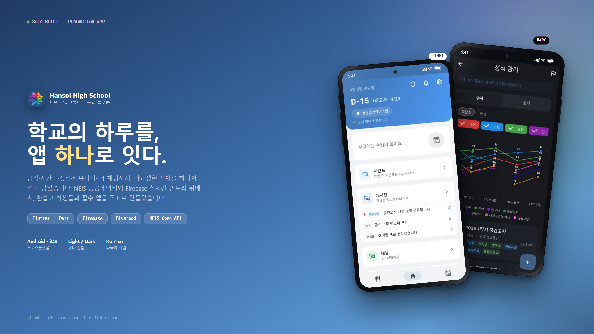
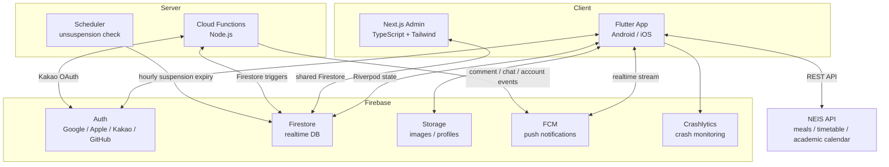
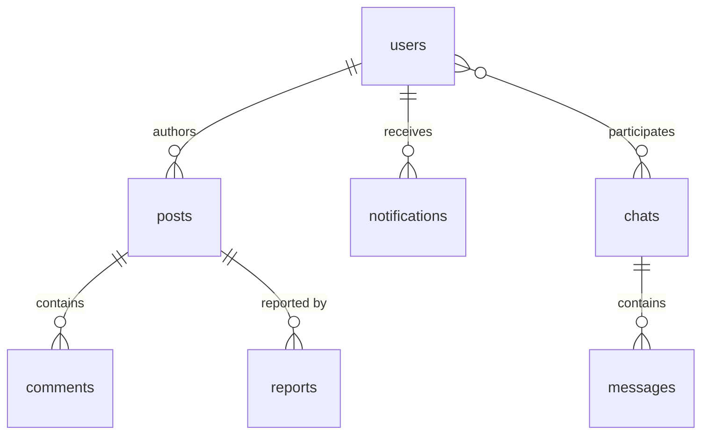

# Hansol High School App

> 한국어: [README.md](./README.md)

> An integrated school platform for students, teachers, alumni, and parents of Hansol High School (Sejong, Korea).

A full-stack project with a Flutter mobile app + Next.js admin dashboard. Features NEIS public-data API integration, Firebase real-time database, role-based access control, push notifications, 1:1 chat — at a production-service level.

[Dev Blog](https://monkshark.github.io/categories/%ED%95%9C%EC%86%94%EA%B3%A0-%EC%95%B1-%EA%B0%9C%EB%B0%9C%EA%B8%B0/)

## Documentation Hub

Documentation is split by topic. Jump in based on your purpose.

### First-time Contributors
1. [Product Overview](https://monkshark.github.io/hansol_hs_flutter_app/#guides/product-overview_en.md)
2. [Architecture Overview](https://monkshark.github.io/hansol_hs_flutter_app/#guides/architecture-overview_en.md)
3. [Architecture Decisions (ADRs)](https://monkshark.github.io/hansol_hs_flutter_app/#guides/architecture-decisions_en.md)
4. Feature deep-dives: [Public](https://monkshark.github.io/hansol_hs_flutter_app/#features/public-features_en.md) / [Community](https://monkshark.github.io/hansol_hs_flutter_app/#features/community-features_en.md) / [Personal](https://monkshark.github.io/hansol_hs_flutter_app/#features/personal-features_en.md) / [Admin](https://monkshark.github.io/hansol_hs_flutter_app/#features/admin-features_en.md)
5. [Contributing Guide](https://monkshark.github.io/hansol_hs_flutter_app/#CONTRIBUTING_en.md)

### End Users (Students / Teachers / Alumni / Parents)
- [User Guide](https://monkshark.github.io/hansol_hs_flutter_app/#USER_GUIDE_en.md)
- [Public Features](https://monkshark.github.io/hansol_hs_flutter_app/#features/public-features_en.md)
- [Account & Access](https://monkshark.github.io/hansol_hs_flutter_app/#guides/account-and-access_en.md)

### Operations / Deployment
- [Deployment Guide](https://monkshark.github.io/hansol_hs_flutter_app/#DEPLOY_en.md)
- [CI/CD Setup](https://monkshark.github.io/hansol_hs_flutter_app/#guides/cicd-setup_en.md)
- [Security Model](https://monkshark.github.io/hansol_hs_flutter_app/#guides/security_en.md)
- [Architecture Overview](https://monkshark.github.io/hansol_hs_flutter_app/#guides/architecture-overview_en.md)

### Further Reading
- [Data Model](https://monkshark.github.io/hansol_hs_flutter_app/#guides/data-model_en.md)
- [Testing Strategy](https://monkshark.github.io/hansol_hs_flutter_app/#guides/testing_en.md) — 563 Flutter + 85 Rules tests
- [Technical Challenges (14 cases)](https://monkshark.github.io/hansol_hs_flutter_app/#guides/technical-challenges_en.md)
- [PIPA Migration Guide](https://monkshark.github.io/hansol_hs_flutter_app/#guides/pipa-migration_en.md) — custom claims backfill + TTL collection design
- [PIPA Integration Test Scenarios](https://monkshark.github.io/hansol_hs_flutter_app/#guides/pipa-integration-tests_en.md)
- [Screenshots Gallery](https://monkshark.github.io/hansol_hs_flutter_app/#guides/screenshots-gallery_en.md)

### Per-File Technical Reference
> Detailed per-file docs for service / model / API / notification layers (for editing a specific file or tracing a flow)

- [📚 Full API Reference Index](https://monkshark.github.io/hansol_hs_flutter_app/#README.md) — consolidated index for the items below
- [`main.md`](https://monkshark.github.io/hansol_hs_flutter_app/#main.md) — app entry point, MainScreen, global state
- **API layer** (`docs/api/`): [meal_data_api](https://monkshark.github.io/hansol_hs_flutter_app/#api/meal_data_api.md) · [timetable_data_api](https://monkshark.github.io/hansol_hs_flutter_app/#api/timetable_data_api.md) · [notice_data_api](https://monkshark.github.io/hansol_hs_flutter_app/#api/notice_data_api.md)
- **Data layer** (`docs/data/`): [auth_service](https://monkshark.github.io/hansol_hs_flutter_app/#data/auth_service.md) · [grade_manager](https://monkshark.github.io/hansol_hs_flutter_app/#data/grade_manager.md) · [local_database](https://monkshark.github.io/hansol_hs_flutter_app/#data/local_database.md) · [post_repository](https://monkshark.github.io/hansol_hs_flutter_app/#data/post_repository.md) · [search_tokens](https://monkshark.github.io/hansol_hs_flutter_app/#data/search_tokens.md) · [service_locator](https://monkshark.github.io/hansol_hs_flutter_app/#data/service_locator.md) · [setting_data](https://monkshark.github.io/hansol_hs_flutter_app/#data/setting_data.md) · etc.
- **Notifications** (`docs/notification/`): [fcm_service](https://monkshark.github.io/hansol_hs_flutter_app/#notification/fcm_service.md) · [daily_meal_notification](https://monkshark.github.io/hansol_hs_flutter_app/#notification/daily_meal_notification.md) · [popup_notice](https://monkshark.github.io/hansol_hs_flutter_app/#notification/popup_notice.md) · [update_checker](https://monkshark.github.io/hansol_hs_flutter_app/#notification/update_checker.md)
- **State Management** (`docs/providers/`): [providers](https://monkshark.github.io/hansol_hs_flutter_app/#providers/providers.md) — all Riverpod Notifier/AsyncNotifier
- **Network** (`docs/network/`): [network_status](https://monkshark.github.io/hansol_hs_flutter_app/#network/network_status.md) · [offline_queue_manager](https://monkshark.github.io/hansol_hs_flutter_app/#network/offline_queue_manager.md)
- **Styles** (`docs/styles/`): [app_colors](https://monkshark.github.io/hansol_hs_flutter_app/#styles/app_colors.md) · [dark_app_colors](https://monkshark.github.io/hansol_hs_flutter_app/#styles/dark_app_colors.md) · [light_app_colors](https://monkshark.github.io/hansol_hs_flutter_app/#styles/light_app_colors.md)

## Screenshots (Summary)

| Home | Board | Chat | Timetable |
|:--:|:--:|:--:|:--:|
|  |  |  |  |

| Meal | Search Results | Grades (Susi) | Admin Web |
|:--:|:--:|:--:|:--:|
|  |  |  |  |

Full gallery → [Screenshots Gallery](https://monkshark.github.io/hansol_hs_flutter_app/#guides/screenshots-gallery_en.md)

## Metrics

| Metric | Value | Notes |
|---|---|---|
| **Total LOC** | **~51,900** | Dart 44,349 (excl. generated) + TypeScript/TSX 3,057 + JS 2,940 + Java/XML 1,174 + Swift 373 |
| **Source files** | **193** (Flutter, excl. generated) + **30** (Admin Web TS/TSX) + Android/iOS widgets | screens, extracted widgets, models/utils/services |
| **Role model** | **4 tiers** | `user` / `moderator` / `auditor` / `manager` / `admin` — checked via Firebase Auth custom claims (zero Firestore `get()` in rules) |
| **PIPA compliance** | **3 collections** | `appeals` (90-day TTL) · `data_requests` (30-day TTL) · `community_rules` |
| **Cloud Functions** | **24** | Kakao/School OTP · triggers (post/comment/like/user CRUD/chat/report) · suspension scheduler · OG renderer · old-post cleanup · data export · progressive suspension · annual grade promotion · teacher invite |
| **OAuth providers** | **4** | Google, Apple, Kakao, GitHub |
| **Push notifications** | **4 FCM types** | `account` / `comment` / `new_post` / `chat` (+ local breakfast/lunch/dinner). Per-category on/off |
| **Tests** | **563 / 85** | Flutter 559 (test 470 + testWidgets 89) + Integration 4 + Firestore Rules emulator 85 |
| **Docs** | **106 MDs** | Root 9 + `docs/guides/` 22 + `docs/features/` 8 + per-file details `docs/{api,data,...}` 67 |
| **State management** | **Riverpod 2.5** | AsyncNotifier/Notifier + GetIt + repository DI |
| **Image compression** | **~70% reduction** | Posts: 1080px w/ EXIF/GPS stripped, profiles: 256px |
| **Search** | **Firestore n-gram index** | Title+body 2-gram `array-contains-any`, 350ms debounce |
| **Sensitive data** | **flutter_secure_storage** | Grades live in Android Keystore / iOS Keychain only |
| **API optimization** | **30 calls → 1** | Monthly prefetch + Completer pattern |
| **Firestore reads** | **30–50% reduction** | Offline cache + `limit()` optimization |
| **Operating cost** | **$0–3/month** | ~1,000 users, within free tier |

### Performance / Size (measured)

| Item | Value | Method |
|---|---|---|
| **Release APK** | **27 MB** | `build/app/outputs/flutter-apk/app-release.apk` (universal) |
| **Dart LOC** | **44,349** | `find lib test integration_test -name '*.dart' ! -name '*.g.dart' ! -name '*.freezed.dart' \| xargs cat \| wc -l` |
| **Dart files** | **193** | `find lib test integration_test -name '*.dart' ! -name '*.g.dart' ! -name '*.freezed.dart' \| wc -l` |
| **Flutter test count** | **563** | test() 470 + testWidgets() 89 + Integration 4 |
| **Rules test count** | **85** | `firebase emulators:exec ... npm test` (covers 4-tier roles + PIPA collections) |
| **Compressed image size** | **~30% of original** | 1080px wide, JPEG q80, EXIF stripped |
| **Search fetch limit** | **50 / 350ms debounce** | `array-contains-any` + client-side substring filter |
| **Board page size** | **20 / cursor pagination** | `startAfterDocument` + `limit(20)` |

## Architecture (Summary)

- **Riverpod provider dependency graph** and **layered data-flow model** → [architecture-overview_en.md](https://monkshark.github.io/hansol_hs_flutter_app/#guides/architecture-overview_en.md)
- Storage allocation rationale (sqflite / Firestore / SecureStorage / Cloud Storage) → [ADR-06](https://monkshark.github.io/hansol_hs_flutter_app/#guides/architecture-decisions_en.md#adr-06-storage-allocation)

### 🔗 [Interactive Riverpod Graph](https://monkshark.github.io/hansol_hs_flutter_app/riverpod_graph.html)

D3.js-based zoom/drag graph. Source HTML at `docs/riverpod_graph.html`.

## Architecture Decisions (Summary)

| ADR | Decision | Link |
|---|---|---|
| 01 | State mgmt = Riverpod 2.5 | [link](./docs/guides/architecture-decisions_en.md#adr-01-state-management-riverpod-25) |
| 02 | Grade storage = flutter_secure_storage (local-only) | [link](./docs/guides/architecture-decisions_en.md#adr-02-sensitive-data-storage-flutter_secure_storage) |
| 03 | Board search = client-side n-gram index | [link](./docs/guides/architecture-decisions_en.md#adr-03-board-search-client-side-n-gram-indexing) |
| 04 | Like counter = `Map<uid,bool>` + denormalized int | [link](./docs/guides/architecture-decisions_en.md#adr-04-like-counter-mapuidbool--denormalized-int) |
| 05 | Charts = direct `CustomPainter` | [link](./docs/guides/architecture-decisions_en.md#adr-05-charts-custompainter-directly) |
| 06 | Storage allocation = SQLite/Firestore/SecureStorage/Cloud Storage | [link](./docs/guides/architecture-decisions_en.md#adr-06-storage-allocation) |
| 07 | DI = GetIt + abstract repository | [link](./docs/guides/architecture-decisions_en.md#adr-07-di-getit--abstract-repository) |
| 08 | Test strategy = 4 layers (Unit/Provider/Widget/Rules) | [link](./docs/guides/architecture-decisions_en.md#adr-08-test-strategy-unit--provider--widget--rules) |
| 09 | Roles = 4 tiers (user/moderator/auditor/manager/admin) + Firebase Auth custom claims | — |
| 10 | PIPA = `appeals`/`data_requests`/`community_rules` + `expiresAt` TTL for lifecycle automation | — |
| 11 | Dashboard counters = denormalized `app_stats/totals` (`FieldValue.increment`) | — |

Full details → [architecture-decisions_en.md](https://monkshark.github.io/hansol_hs_flutter_app/#guides/architecture-decisions_en.md).

## Tech Stack

| Category | Tech |
|---|---|
| **Mobile** | Flutter (Dart) — Android / iOS |
| **State** | Riverpod 2.5 — AsyncNotifier / Notifier |
| **DI** | GetIt + abstract repository — mockable |
| **Admin Web** | Next.js 14 — App Router, TypeScript, Tailwind |
| **Backend** | Firebase — Auth, Firestore, Storage, FCM, Crashlytics |
| **Server** | Cloud Functions (Node.js) — push, Kakao OAuth, scheduler |
| **External API** | NEIS public data — meals, timetable, academic calendar |
| **Local** | sqflite (schedule DB), SharedPreferences (settings/cache) |
| **Auth** | Google / Apple / Kakao / GitHub OAuth |
| **CI** | GitHub Actions — analyze + test + Codecov + Android APK |
| **Test** | `flutter_test` — Unit + Widget + Provider + Golden + Integration (563) + Firestore rules (85) |

## Features (Summary)

| Category | Highlights | Deep dive |
|---|---|---|
| **Public** | Meals, timetable, academic calendar, urgent popup, home widgets (Android/iOS), offline | [public-features_en.md](https://monkshark.github.io/hansol_hs_flutter_app/#features/public-features_en.md) |
| **Community** | Board (6 categories + popular + n-gram search), 1:1 chat, notifications, feedback | [community-features_en.md](https://monkshark.github.io/hansol_hs_flutter_app/#features/community-features_en.md) |
| **Personal** | Grades (susi/jeongsi, local-only), schedules, D-day, profile, appeals, data export requests | [personal-features_en.md](https://monkshark.github.io/hansol_hs_flutter_app/#features/personal-features_en.md) |
| **Admin** | Flutter admin + Next.js Admin Web (AdminShell + dark mode + 30s TTL cache), 4-tier role separation (moderator: report-only / auditor: read-only / manager: suspension / admin: role changes), appeal review, data-request handling, community-rules editor, admin_logs (1-year TTL) | [admin-features_en.md](https://monkshark.github.io/hansol_hs_flutter_app/#features/admin-features_en.md) |

## Security & Privacy

- **4-tier roles + custom claims**: `user` / `moderator` / `auditor` / `manager` / `admin` are baked into the Firebase Auth ID token, so security rules check them with zero `get()` calls.
- **Firestore rules**: role-based access control + per-field update validation + `validCounterDelta(±1)`
- **PIPA compliance**: `appeals` / `data_requests` / `community_rules` collections with `expiresAt` TTL auto-deletion (admin_logs 1y / appeals 90d / data_requests 30d).
- **Grades stay local**: `flutter_secure_storage` → Android Keystore / iOS Keychain. Never uploaded.
- **Rate limiting**: 30s post cooldown, 10s comment cooldown, duplicate-report index, progressive suspension (`applyProgressiveSuspension`).
- **On deletion**: Firestore → Storage → Auth order for complete erasure, daily `purgeDeactivatedAccounts` sweep.
- **OAuth only**: no passwords stored.

Details → [security_en.md](https://monkshark.github.io/hansol_hs_flutter_app/#guides/security_en.md).

## Testing & CI/CD

- **563 Flutter tests + 85 Rules tests** (Unit / Widget / Provider / Golden / Repository / Integration / Firestore Rules — covering 4-tier roles + PIPA collections)
- `flutter test` locally / `firebase emulators:exec ... npm test` for rules
- Two GitHub Actions workflows: [flutter.yml](./.github/workflows/flutter.yml), [firestore-rules.yml](./.github/workflows/firestore-rules.yml)
- Codecov upload, debug APK artifact on master push

Details → [testing_en.md](https://monkshark.github.io/hansol_hs_flutter_app/#guides/testing_en.md), [cicd-setup_en.md](https://monkshark.github.io/hansol_hs_flutter_app/#guides/cicd-setup_en.md).

## Data Model (Summary)

Collection schema, indexes, and rule mappings → [data-model_en.md](https://monkshark.github.io/hansol_hs_flutter_app/#guides/data-model_en.md).

## Technical Challenges (Highlights)

3 picks from 14 cases encountered during development:

<b>Admin screen Firestore reads: 130 → 20–30</b>

Swapped `StreamBuilder` for `FutureBuilder` + collapsed `ExpansionTile` child lazy render. Closed tabs do 0 reads.

→ [technical-challenges_en.md#9](./docs/guides/technical-challenges_en.md#9-admin-screen-firestore-read-overload-stream--future-transition)

<b>StatefulWidget 1,400+ lines → Stateless composition (-43%)</b>

Four large screens 4,575 → 2,589 lines, 15 widget modules extracted, 113 tests still green.

→ [technical-challenges_en.md#13](./docs/guides/technical-challenges_en.md#13-statefulwidget-1400-lines--stateless-composition-refactoring)

<b>Riverpod AsyncNotifier <code>invalidateSelf</code> race</b>

Async `ref.invalidateSelf()` made provider tests flaky. Fixed by replacing state directly in mutators.

→ [technical-challenges_en.md#11](./docs/guides/technical-challenges_en.md#11-riverpod-asyncnotifier-race-condition-invalidateself)

**All 14 cases** → [technical-challenges_en.md](https://monkshark.github.io/hansol_hs_flutter_app/#guides/technical-challenges_en.md)

## License

Published for learning and portfolio purposes. School logos and image assets may not be reused.

## Contact

- Bugs / feature requests: GitHub Issues · justinchoo0814@gmail.com · IG [@void___main](https://instagram.com/void___main)
- In-app: Settings → Feedback / bug report
