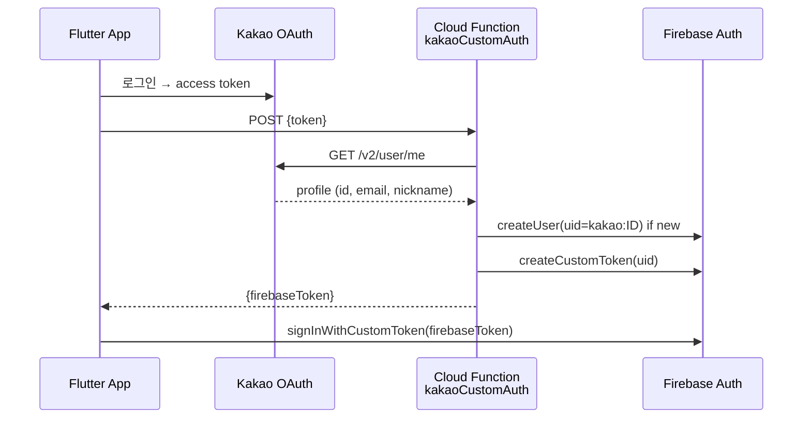
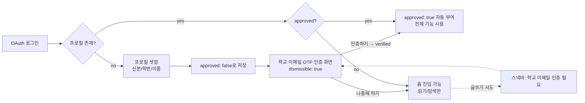
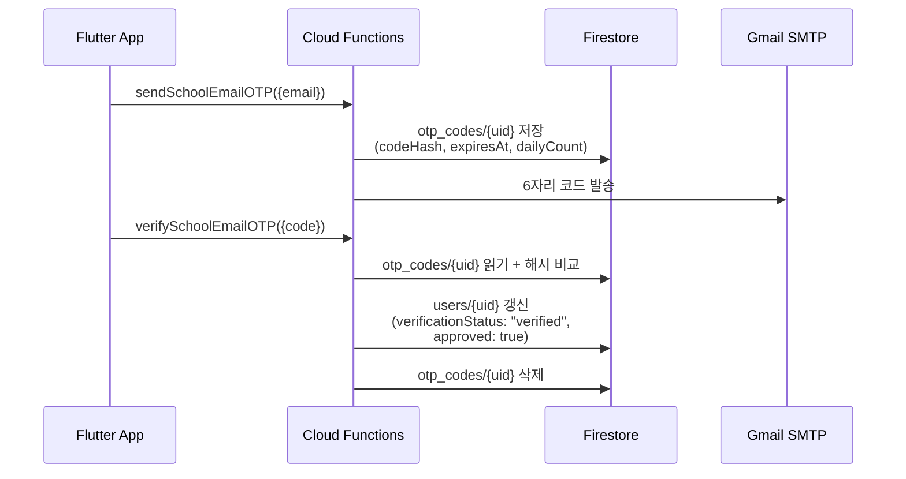

# 인증 & 접근 제어

> English: [account-and-access_en.md](./account-and-access_en.md)

한솔고등학교 앱의 인증, 역할, 승인 플로우, 정지/탈퇴 절차를 정리합니다.

## 인증 방식 — 4종 OAuth

| Provider | 구현 방식 |
|---|---|
| **Google** | `google_sign_in` + Firebase Auth 직접 |
| **Apple** | `sign_in_with_apple` + Firebase Auth 직접 |
| **Kakao** | `kakao_flutter_sdk_user` → 자체 Cloud Function (`kakaoCustomAuth`) → Firebase Custom Token |
| **GitHub** | Firebase Auth OAuth provider |

비밀번호는 저장하지 않습니다. 각 Provider의 OAuth token만 사용.

### Kakao 커스텀 토큰 플로우



- zod 스키마로 입력 검증 (`KakaoAuthSchema`)
- 프로필 사진은 Firestore `users/{uid}.profilePhotoUrl` 에 저장 (없는 경우만)

## 신분 (`userType`)

가입 시 선택:
- `student` — 재학생 (학번 입력 필수)
- `graduate` — 졸업생 (졸업 연도 입력)
- `teacher` — 교사 (담당 과목 입력)
- `parent` — 학부모

신분에 따라 기본 역할 = `user`. 이후 관리자 승인 절차.

## 역할 체계

| `role` | 인원 | 대상 | 권한 |
|---|---|---|---|
| `admin` | 1-2명 | 담당 교사 | 모든 권한, 역할 부여 |
| `manager` | 2-3명 | 학생회장/부회장 | 사용자 관리, 콘텐츠 삭제, 신고 처리, 설정 |
| `moderator` | 5-7명 | 일반 학생회 임원 | 게시글/댓글 삭제, 신고 조회/처리 전담 |
| `auditor` | 1명 | 졸업생 개발자/담당 교사 | 읽기 전용 감사자 — 로그/통계/신고/건의사항 조회 |
| `user` | — | 일반 사용자 | 일반 기능 (승인 후) |

`admin`, `manager`, `moderator`, `auditor`를 통칭하여 **staff** 라 부릅니다.

**Flutter 모델** (`UserProfile`):
- `isModerator` / `isAuditor` / `isStaff` getter 추가
- `isApproved()` — staff(`isStaff`)는 승인 절차 우회 (기존 `isManager` 기준에서 변경)
- 홈 화면 Admin 방패 버튼 — `isStaff` 기준 표시 (기존 `isManager`에서 변경)

**승급/강등**: `admin`만 가능. 감사 로그(`admin_logs`)에 이전→이후 기록.

## 가입 & 인증 플로우



- 가입 직후 인증 화면이 자동으로 뜨지만 **"나중에 하기"** 로 스킵 가능 (홈 진입은 막지 않음)
- 학교 이메일 OTP 인증 통과 = 자동 승인 (`verifySchoolEmailOTP`가 `approved: true`도 함께 set)
- 별도의 관리자 승인 단계는 없음. Admin이 사용자를 비활성화하려면 정지(`suspend`)/거절(`reject`)
- 미인증 상태는 글쓰기/댓글/신고/채팅이 차단됨 (`isApproved()` 가드 + Firestore rules `canWrite()`)
- staff(`admin`/`manager`/`moderator`/`auditor`)는 인증 없이도 통과 (`isApproved()`가 `isStaff` 우회)
- 학생 도메인이 없는 케이스(학부모/일부 교사/grandfathered)는 admin이 pending 탭에서 manual approve

## 학교 이메일 인증 (OTP)

PIPA 청소년 조항 + 외부인 차단을 위해 학교에서 발급한 이메일 도메인으로 본인 확인.

**허용 도메인**: `edu.sje.go.kr`, `sjhansol.sjeduhs.kr` (Functions `SCHOOL_EMAIL_DOMAINS` 상수)

### 플로우



### 상태 필드 (`users/{uid}`)

| 필드 | 값 |
|---|---|
| `verificationStatus` | `pending` (가입 직후) / `verified` (성공) |
| `schoolEmail` | 인증된 이메일 주소 |
| `verifiedAt` | 서버 타임스탬프 |
| `verifiedVia` | `otp` |
| `approved` | OTP 통과 시 `true`로 자동 set |
| `approvedAt` | OTP 통과 시점 서버 타임스탬프 |
| `approvedVia` | `otp` (OTP 자동승인) / `admin` (수동 부여) |

신규 가입 시 `ProfileSetupScreen`이 `verificationStatus: 'pending'`으로 저장하고 인증 화면을 푸시. 사용자는 인증을 완료하거나 "나중에 하기"로 스킵 가능 — 스킵 시 홈 진입은 가능하나 글쓰기 등은 차단된다.

### 보안 / 레이트 리밋

| 항목 | 값 | 위치 |
|---|---|---|
| 코드 길이 | 6자리 숫자 | `crypto.randomInt(0, 1000000)` |
| 저장 방식 | sha256 해시 | 평문 미보관 |
| 만료 | 30분 | `expiresAt` |
| 재전송 간격 | 120초 | `lastSentAt` 비교 |
| 일일 발송 한도 | 5회 | `dailyKey` + `dailyCount` |
| 시도 한도 | 5회 | `attempts` 카운트 → 초과 시 OTP 삭제 |
| 인증 성공/만료 | OTP 즉시 삭제 | 재사용 불가 |

`otp_codes/{uid}` 컬렉션은 클라이언트 read/write 전부 거부 (Cloud Functions 전용). [security.md#신규-컬렉션-pipa-대응](./security.md#신규-컬렉션-pipa-대응) 참조.

### `isVerified()` 가드

```js
function canWrite() { return isVerified() && isNotSuspended(); }
```

`posts` / `comments` / `reports` / `chats/messages` create는 `canWrite()` 통과 필수. 미인증 사용자는 글/댓글/신고/채팅이 막힙니다.

**Grandfathering**: `verificationStatus` 필드가 없는 기존 사용자는 `'verified'`로 처리되어 통과 (`data.get('verificationStatus', 'verified')`). 신규 가입자만 인증 단계를 거칩니다.

### 클라이언트 가드

`VerificationGuard.check()` (`lib/providers/verification_guard.dart`)가 글쓰기/댓글/신고 진입점에서 호출:
- 정지 → 정지 다이얼로그 + 이의제기 진입
- 미인증 → 인증 안내 다이얼로그 → "인증하기" 시 `EmailVerificationScreen` 푸시 → 성공 시 `userProfileProvider` invalidate

### Functions Secrets

`GMAIL_SENDER_EMAIL`, `GMAIL_APP_PASSWORD`를 Functions secrets로 관리. Gmail 앱 비밀번호로 SMTP 발송. `firebase functions:secrets:set GMAIL_SENDER_EMAIL` / `... GMAIL_APP_PASSWORD`로 등록.

**관련 파일**: `functions/index.js` (`sendSchoolEmailOTP`, `verifySchoolEmailOTP`), `lib/screens/auth/email_verification_screen.dart`, `lib/providers/verification_guard.dart`

## 정지 & 해제

- **정지 기간**: 1시간 / 6시간 / 1일 / 3일 / 7일 / 30일 / 영구
- 필드: `users/{uid}.suspendedUntil` (timestamp)
- 정지 중에는 글/댓글/채팅 작성 차단 (rules + 클라이언트)

### 자동 해제

Cloud Functions 스케줄러 (`checkSuspensionExpiry`, 매시간):
1. `suspendedUntil <= now` 조회
2. 필드 삭제
3. `onUserUpdated` 트리거 → 해제 푸시 발송

## 탈퇴

이중 확인 다이얼로그 → 완전 삭제:
1. 하위 컬렉션 (`users/{uid}/{subjects,sync,notifications}`) 삭제
2. `users/{uid}` 문서 삭제 (인증 상태 유지 중)
3. Cloud Storage 프로필 사진 삭제
4. `user.delete()` — Auth 계정 삭제

순서가 중요: Auth 먼저 삭제 시 Firestore에서 PERMISSION_DENIED ([기술과제 #10](./technical-challenges.md#10-계정-삭제-순서-문제)).

## 로그인 상태 이슈

### 토큰 전파 지연

OAuth 직후 Firestore 접근 시 PERMISSION_DENIED 가능. `getIdToken(true)`로 강제 갱신 + 최대 3회 재시도 ([기술과제 #1](./technical-challenges.md#1-firebase-auth-토큰-동기화-문제)).

### 새 학기 업데이트

재학생/교사는 3월에 학년/반/번호 입력 팝업 표시. 역할은 변경 불가.

## 역할별 기능 매트릭스

| 기능 | user | moderator | auditor | manager | admin |
|---|:---:|:---:|:---:|:---:|:---:|
| 글/댓글 작성 | ✅ | ✅ | ❌ | ✅ | ✅ |
| 글/댓글 삭제 (타인) | ❌ | ✅ | ❌ | ✅ | ✅ |
| 신고 조회/처리 | ❌ | ✅ | 조회만 | ✅ | ✅ |
| 사용자 승인 | ❌ | ❌ | ❌ | ✅ | ✅ |
| 사용자 정지 | ❌ | ❌ | ❌ | ✅ | ✅ |
| 역할 변경 | ❌ | ❌ | ❌ | ❌ | ✅ |
| 공지 고정 | ❌ | ❌ | ❌ | ✅ | ✅ |
| 긴급 팝업 관리 | ❌ | ❌ | ❌ | ✅ | ✅ |
| 설정 관리 | ❌ | ❌ | ❌ | ✅ | ✅ |
| 로그/통계 조회 | ❌ | ❌ | ✅ | ✅ | ✅ |
| 건의사항 조회 | ❌ | ❌ | ✅ | ✅ | ✅ |
| Admin 화면 접근 | ❌ | ✅ | ✅ | ✅ | ✅ |
| 감사 로그 조회 | ❌ | ❌ | ✅ | ✅ | ✅ |

상세 규칙은 [security.md](./security.md) 참조.

## 관련 문서
- [보안 모델](./security.md)
- [관리자 기능](../features/admin-features.md)
- [데이터 모델](./data-model.md) — `users` 스키마 상세
- [엔드유저 가이드](../USER_GUIDE.md)
