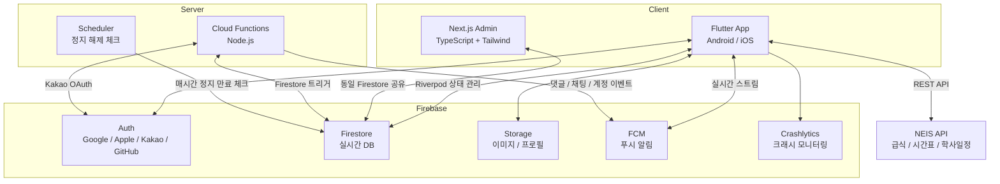
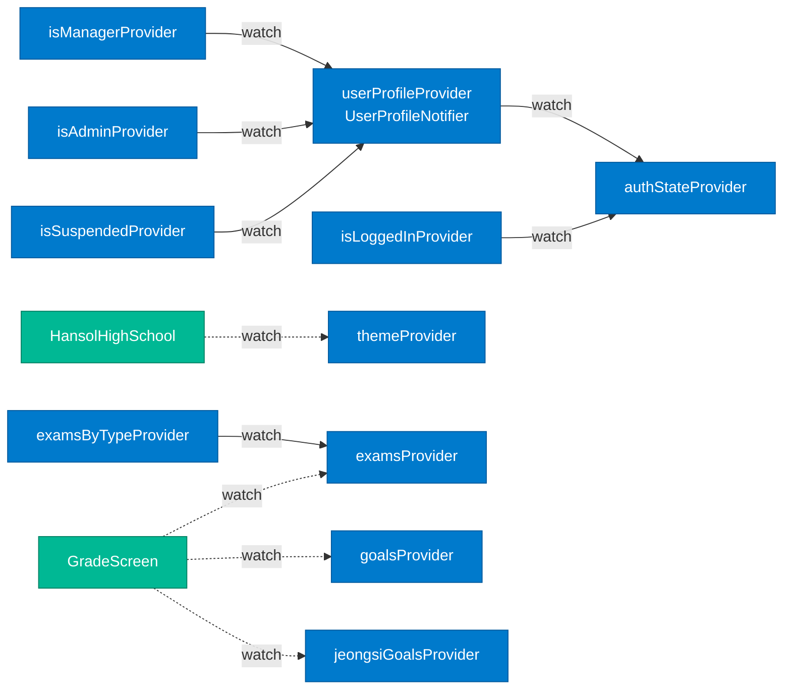
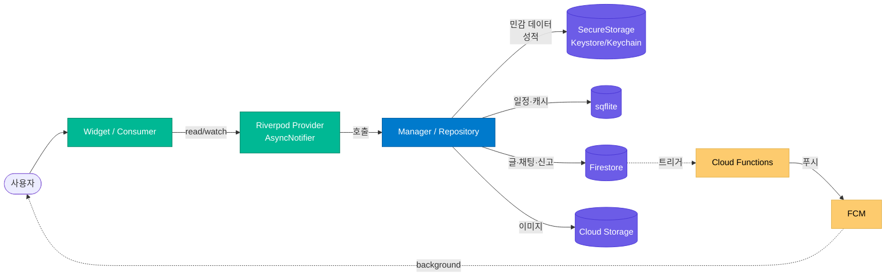

# 아키텍처 개요

> English: [architecture-overview_en.md](./architecture-overview_en.md)

한솔고등학교 앱은 **Flutter 모바일 + Next.js 관리자 대시보드** 듀얼 클라이언트가 **Firebase** 공통 백엔드를 공유하는 구조다. 이 문서는 시스템 전체 그림, Riverpod 상태 그래프, 데이터 흐름 계층 모델을 한 곳에서 설명한다.

## 시스템 다이어그램



### 컴포넌트별 역할

| 컴포넌트 | 위치 | 역할 |
|---|---|---|
| **Flutter App** | `/lib` | 메인 사용자 인터페이스. Android/iOS 동일 바이너리 |
| **Next.js Admin** | `/admin-web` | 웹 기반 관리자 대시보드. Firestore를 앱과 공유 |
| **Admin Static** | `/admin-static` | 간단한 정적 관리자 페이지 (현재 레거시) |
| **Cloud Functions** | `/functions/index.js` | Kakao OAuth 커스텀 토큰, 푸시 알림 트리거, 스케줄러 |
| **Android Widget** | `/android/.../widget` | 홈 화면 위젯 (급식/시간표/통합) |
| **iOS Widget** | `/ios/Widget*` | WidgetKit 기반 홈 위젯 |

## 레이어 구조 (Flutter)

```
lib/
├── main.dart                # 앱 진입점
├── api/                     # NEIS 등 외부 REST API 래퍼
├── data/                    # 정적 상수 / 공용 데이터 (요일, 등급컷 등)
├── network/                 # Firestore / Storage 접근 레이어
├── notification/            # FCM 토큰 관리, 인앱 알림, 로컬 알림
├── providers/               # Riverpod 전역 Provider (auth, grade, settings, theme)
├── screens/                 # 화면 (auth, board, chat, main, sub)
├── styles/                  # 테마, 컬러, 텍스트 스타일
└── widgets/                 # 재사용 Stateless 위젯
```

### Dependency 방향
- **screens → providers → network/api** (단방향)
- **screens는 network를 직접 호출하지 않음** (Provider 경유)
- **widgets는 데이터 의존 없이 순수 UI** (Stateless)

## Riverpod Provider 의존성 그래프

`riverpod_graph` CLI로 정적 분석 후 자동 생성. 아래는 mermaid 요약본이고, **🔗 [인터랙티브 버전](https://monkshark.github.io/hansol_hs_flutter_app/riverpod_graph.html)** 에서 D3.js 기반 zoom/drag 그래프로 모든 노드 탐색 가능. 원본 HTML은 `docs/riverpod_graph.html`에 보관.



### 파생 관계 설명
- `authStateProvider`를 root로 하는 **인증 상태 트리**: 프로필 → 권한(moderator/auditor/manager/admin/suspended) 파생 — 권한은 Firebase Auth custom claims에서 직접 읽음
- `examsProvider` 기반으로 `examsByTypeProvider` (수시/정시 분류) 파생
- 화면(`Consumer`)은 필요한 leaf provider만 `watch` → 불필요한 rebuild 방지
- `autoDispose` 적극 사용으로 화면 이탈 시 자동 해제

### Provider 분류
- **동기 Notifier** (`theme`, `isLoggedIn`): 단순 상태 전환
- **AsyncNotifier** (`userProfile`, `exams`, `goals`): Firestore/SecureStorage 비동기 로딩
- **파생 Provider** (`isManager`, `examsByType`): 다른 Provider를 watch하여 변환만 수행

## 데이터 흐름 (계층 모델)



### 원칙
- **Widget → Provider**만 직접 의존, Manager/저장소는 Provider 안쪽에 캡슐화
- 저장소는 **데이터 민감도/접근 패턴**에 따라 4가지로 분담 (→ [architecture-decisions.md#adr-06](./architecture-decisions.md#adr-06))
- 쓰기 → Firestore 트리거 → Cloud Functions → FCM 으로 **비동기 푸시 흐름**
- 위젯은 `ProviderScope.overrides`로 테스트에서 Mock Notifier 주입 가능

## 저장소별 책임 분담

| 저장소 | 용도 | 선택 이유 |
|---|---|---|
| **sqflite** | 개인 일정 (시간/색상/연속 일자) | Row 단위 시간 범위 쿼리 + 오프라인 우선 |
| **Firestore** | 글/댓글/채팅/신고/사용자 프로필 | 실시간 sync + 다중 클라이언트 + Cloud Functions 트리거 |
| **SecureStorage** | 성적 | OS 암호화 + 완전 로컬 (서버 전송 없음) |
| **Cloud Storage** | 게시글·프로필 이미지 | CDN + 직접 다운로드 URL |
| **SharedPreferences** | 설정 / 캐시 / 검색 히스토리 | 단순 key-value, 빠른 읽기 |

각각 명확한 단일 용도 → 코드에서 "이 데이터는 어디에 있는가" 헷갈리지 않음.

## 듀얼 클라이언트: Flutter ↔ Admin Web

| 항목 | Flutter (`/lib`) | Admin Web (`/admin-web`) |
|---|---|---|
| **언어** | Dart | TypeScript |
| **UI 프레임워크** | Flutter Material | Next.js 14 + Tailwind CSS |
| **상태 관리** | Riverpod 2.5 | React hooks + SWR |
| **인증** | Firebase Auth SDK (모바일) | Firebase Auth (웹) + 역할 검증 |
| **주요 대상** | 학생/교사/학부모/졸업생 | moderator/auditor/manager/admin 역할만 (4단계) |
| **공유** | Firestore 컬렉션 동일 사용 (`users`, `posts`, ...) | 동일 |

**쓰기 규칙 충돌 방지**: admin-web의 UPDATE 권한은 `firestore.rules`의 `isManager()`/`isAdmin()`/`isAuditor()` 헬퍼로 통일 검증. 모든 역할 검사는 `request.auth.token.role` (Firebase Auth custom claims) 기반이라 Firestore 추가 읽기 0회. 클라이언트 분리와 무관하게 규칙이 단일 진실 소스(Single Source of Truth).

## Cloud Functions 트리거 맵

| Function | 트리거 | 역할 |
|---|---|---|
| `kakaoCustomAuth` | HTTPS onRequest | Kakao access token → Firebase custom token 교환 |
| `sendSchoolEmailOTP` / `verifySchoolEmailOTP` | onCall | 학교 이메일 OTP 발송/검증 (교사 인증) |
| `redeemTeacherInvite` | onCall | 교사 초대 코드 사용 (`teacher` userType + 자동 승인) |
| `postOgRenderer` | HTTPS onRequest | 딥링크용 OG 태그 포함 HTML 렌더링 |
| `onCommentCreated` | `posts/{pid}/comments/{cid}` onCreate | 글 작성자에게 댓글 푸시 + 통계 증분 |
| `onPostCreated` | `posts/{pid}` onCreate | 관리자에게 새 글 푸시 + `app_stats/totals.posts` 증분 |
| `onPostLikeUpdated` | `posts/{pid}` onUpdate | 좋아요 수 변화 감지, 인기글 카운터 보정 |
| `onReportCreated` | `reports/{rid}` onCreate | 신고 접수 시 관리자 푸시 + 로그 기록 + 통계 증분 |
| `aggregateReports` | `reports/{rid}` onCreate | 5분 내 동일 대상 신고 누적 → manager 알림 가속 |
| `onUserCreated` | `users/{uid}` onCreate | 신규 유저 초기화, 커스텀 클레임 부여 (`role: "user"`, `approved: false`) |
| `onUserUpdated` | `users/{uid}` onUpdate | 승인/역할/정지 변경 시 푸시 + 클레임 갱신 |
| `onUserDeleted` | `users/{uid}` onDelete | Auth 계정 + Storage 파일 연쇄 삭제 |
| `onChatMessageCreated` | `chats/{cid}/messages/{mid}` onCreate | 수신자에게 채팅 푸시 |
| `checkSuspensionExpiry` | onSchedule (매시간) | `suspendedUntil <= now`인 유저 필드 삭제 → `onUserUpdated` 연쇄 |
| `applyProgressiveSuspension` | onCall | 누진 정지 (1차 1일 → 2차 7일 → 3차 30일) — manager 전용 |
| `requestAccountDeletion` | onCall | 사용자 본인 탈퇴 신청 (deferred 30일 후 자동 파기) |
| `purgeDeactivatedAccounts` | onSchedule (매일 04:00) | 30일 지난 탈퇴 신청 계정 완전 파기 |
| `createDataExport` | onCall | 본인 데이터 (게시글/댓글/신고/채팅) JSON 익스포트 → Storage 업로드 |
| `purgeExpiredExports` | onSchedule (매일 05:00) | 만료된 `data_requests` 익스포트 파일 청소 |
| `cleanupOldPosts` | onSchedule (매일 18:00) | TTL 만료된 신고/로그 정리 |
| `promoteGradesAnnually` | onSchedule (매년 3/2 0시) | 재학생 학년 자동 진급 + 졸업 처리 |
| `backfillStats` | HTTPS onRequest | 카운터 누락 시 컬렉션 전수 재계산 (수동 도구) |
| `backfillCustomClaims` | HTTPS onRequest | 기존 유저 커스텀 클레임 일괄 재부여 (관리자 도구) |

전체 코드는 `functions/index.js` 참조.

## 참고
- [아키텍처 의사결정 일지](./architecture-decisions.md)
- [데이터 모델 상세](./data-model.md)
- [보안 모델](./security.md)
- [테스트 전략](./testing.md)
